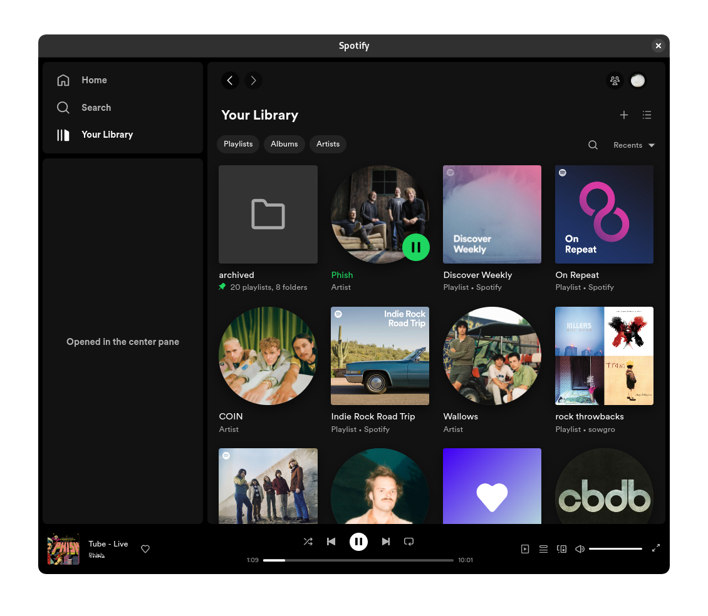

# betterLibrary
A [Spicetify](https://spicetify.app/) custom app which allows the library to be opened in the center pane, similar to how you could before the redesign



## Installation
1. [Install Spicetify](https://spicetify.app/docs/getting-started).
1. Download the source code and unzip it if necessary.
1. Copy betterLibrary from the CustomApps folder into your Spicetify CustomApps folder.
1. Run the following commands to enable the custom app:

    ```
    spicetify config custom_apps betterLibrary
    ```
    ```
    spicetify apply
    ```
## Uninstallation
1. Delete the betterLibrary folder from your Spicetify CustomApps folder.
1. Run the following commands:

   ```
   spicetify config custom_apps betterLibrary-
   ```
   ```
   spicetify apply
   ```
